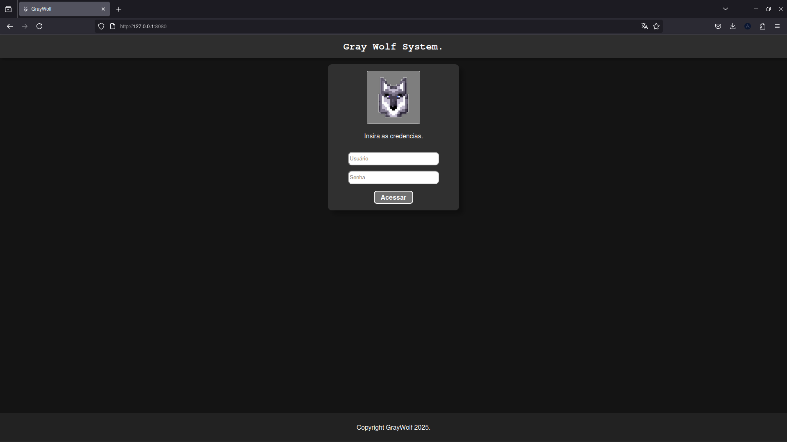
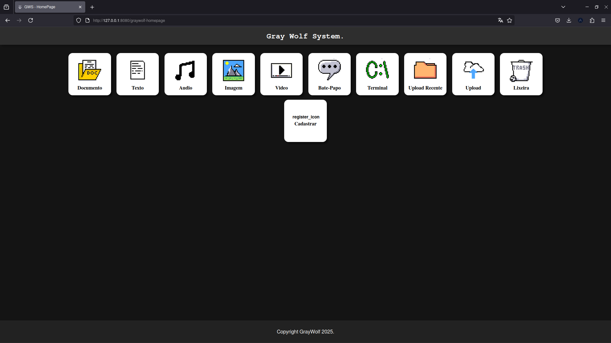
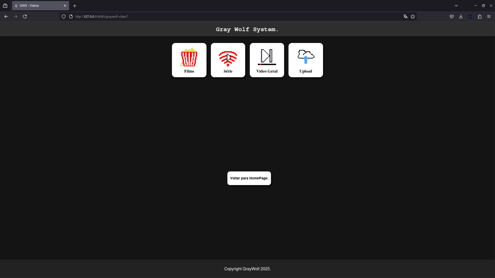
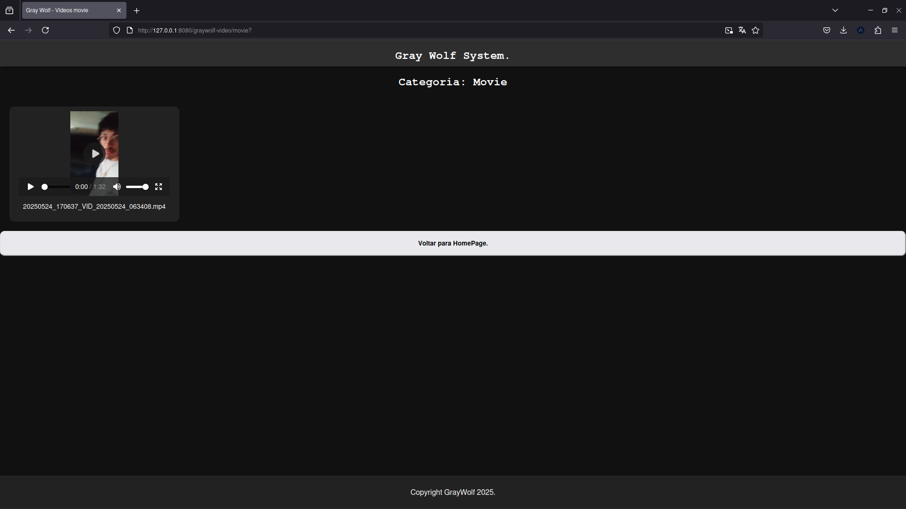
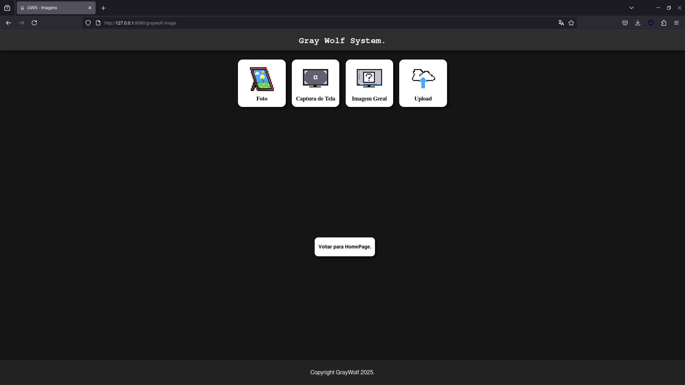
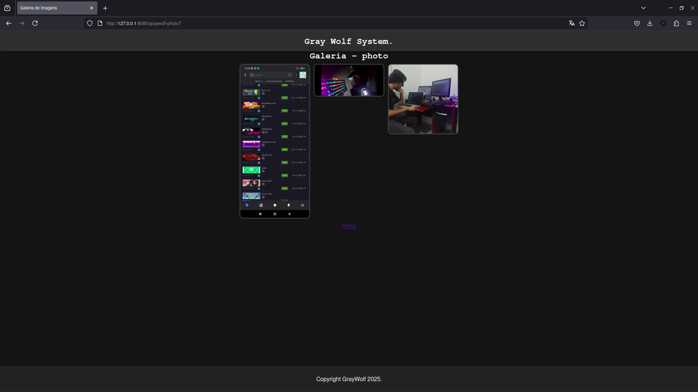

# 🐺 Gray Wolf System (GWS) – v0.8.2 Beta
Sistema pessoal de gerenciamento de arquivos via Flask, com player para vídeos, áudios, imagens e outros… tudo acessado via interface Web responsiva.

# 🐺 Gray Wolf System

Sistema de gerenciamento de arquivos web feito com **Flask (Python)**, ideal para uso pessoal ou em redes locais. Inclui:
- Upload e download de arquivos
- Player de áudio embutido
- Player de video embutido
- Player de imagem embutido
- Visualização de arquivos recem feito upload
- Visualizaçaõ de arquivos de sua categoria
- Interface responsiva com HTML, CSS e JS

---

## 📁 Sobre o projeto

O **Gray Wolf System (GWS)** 
é uma aplicação web leve feita em Flask, com objetivo de transformar qualquer dispositivo com Linux (PC antigo, servidor, celular com Termux) em um servidor local de gerenciamento de arquivos.

Principais recursos:

- Upload e download de arquivos
- Players embutidos para vídeo, áudio e imagens
- Visualização de arquivos por categoria
- Interface moderna e responsiva (HTML + CSS + JS)

## 🎯 Objetivos do projeto

- Usar um navegador para acessar seus arquivos remotamente via IP local
- Organizar arquivos por tipo e categoria
- Economizar espaço em dispositivos móveis
- Usar hardware antigo como servidor local
- Interface simples e fácil de usar

# Como usar

- Você instalar o aplicativo e executa em alguem aparelho com sistema Linux
    - Poder ser servidor
    - Telefone antigo (Não tem mais uso)
    - Computador velho (Sem uso)
- Você o executa usando python 3 e tendo a biblioteca flask instalado!
- Agora seu armazenamento local do servidor (local onde tá sendo executado) vira uma memoria remota de acordo com seu armazenamento atual
- Pode ser acessado pelo ip da maquina onde está o aplicativo instalado ou http://127.0.0.1:8080

---

## 🚧 Status: Beta v0.8

Funcionalidades disponíveis:
- [x] Upload e download de arquivos
- [x] Visualização de vídeos
- [x] Visualização de imagens
- [x] Player de áudio
- [x] Listagem de arquivos enviados recentemente

Funcionalidades pendentes:
- [ ] Chat em tempo real
- [ ] Terminal Web (acesso remoto ao sistema)
- [ ] Lixeira e exclusão de arquivos
- [ ] Registro de novos usuários
- [ ] Sistema de login seguro

---

## ⚙️ Tecnologias usadas

- [x] Flask (Python)
- [x] HTML + CSS + JavaScript
- [x] Hospedagem local em Linux/Android (via Termux)
- [x] Estrutura simples e leve

---

# 🚀 Como executar / instalar

## Clone o repositório
git clone https://github.com/Rian-Batista-Rx4n/web-files-manager-graywolfsystem

cd web-files-manager-graywolfsystem

## (Opcional) Crie um ambiente virtual
python3 -m venv venv
source venv/bin/activate

## Instale as dependências
pip install -r requirements.txt

## Execute o servidor
python app.py

---

### 🔐 Login padrão (temporário)

- Usuário: `rx4n`  
- Senha: `rx4n`

---

## 📸 Capturas de tela

### Tela de Login

### Interface da Homepage

### Categoria Video

### Subcategoria movie

### Categoria Image

### Subcategoria photo

---

## 🧾 Licença

Este projeto está sob a licença MIT. Veja o arquivo [LICENSE](LICENSE) para mais detalhes.
